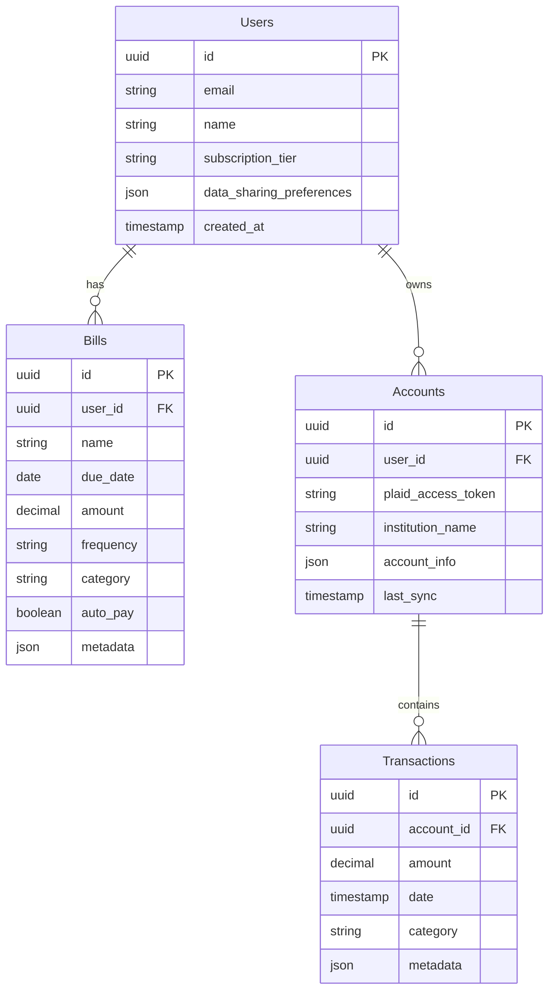
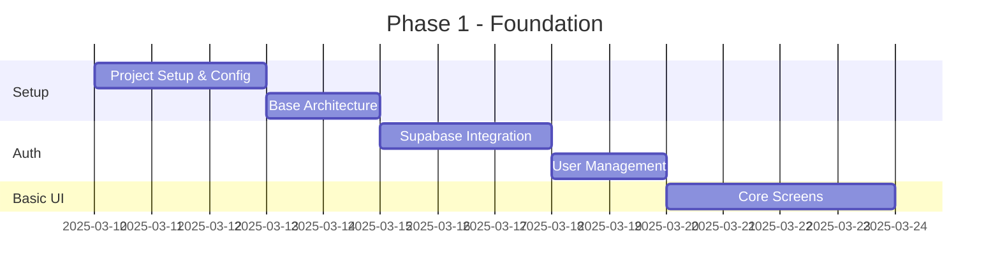
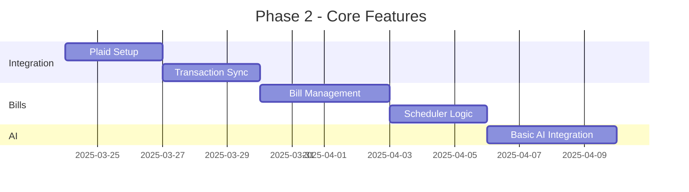
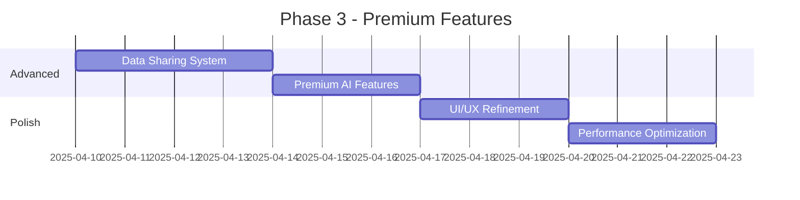
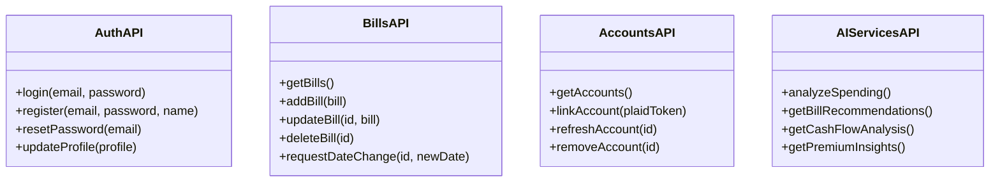
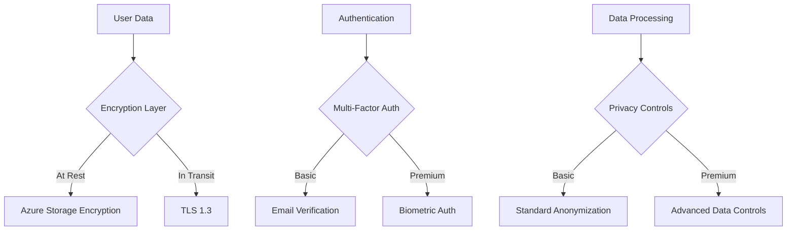
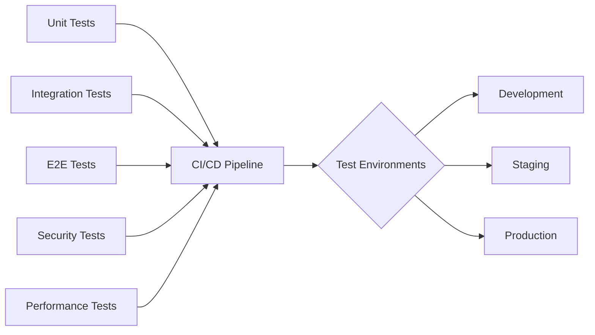

# FlexiBill Implementation Plan

## 1. Technical Stack Decision & Rationale

### Mobile Framework: React Native
- **Reasoning**:
  - Better integration with native APIs (crucial for biometric authentication)
  - Larger ecosystem for financial app components
  - More mature Plaid SDK support
  - Easier to find developers familiar with React/TypeScript
  - Better performance for real-time updates of financial data
  - Excellent TypeScript support for type safety

### Backend Stack
- **Primary**: Node.js/TypeScript
  - Maintains language consistency with frontend
  - Better TypeScript integration with Supabase
  - Rich ecosystem for financial services integration
- **Database**: Supabase (PostgreSQL)
  - Built-in real-time capabilities
  - Row Level Security for data privacy
  - PostgREST API for efficient queries
- **Cloud**: Azure
  - Azure App Service for backend hosting
  - Azure Container Registry for Docker images
  - Azure Key Vault for secrets management

### AI Services
- **Tier 1 (Free)**: Azure OpenAI Service with basic models
  - Basic bill analysis
  - Simple recommendations
- **Tier 2 (Premium)**: Hybrid approach
  - Azure OpenAI Service for advanced features
  - Direct OpenAI API for specialized tasks
  - Custom ML models for payment pattern analysis

## 2. System Architecture

```mermaid
graph TB
    subgraph Mobile Apps
        ios[iOS App]
        android[Android App]
    end

    subgraph Azure Cloud
        api[API Gateway]
        
        subgraph Services
            auth[Auth Service]
            bills[Bill Management]
            ai[AI Service]
            plaid[Plaid Integration]
            scheduler[Bill Scheduler]
        end
        
        subgraph Storage
            supabase[(Supabase DB)]
            vault[Key Vault]
        end
        
        subgraph AI Layer
            basic[Basic AI - Azure OpenAI]
            premium[Premium AI - Hybrid]
        end
    end
    
    subgraph External
        plaid_api[Plaid API]
        openai[OpenAI API]
    end
    
    ios & android --> api
    api --> Services
    Services <--> supabase
    Services <--> vault
    plaid --> plaid_api
    ai --> AI Layer
    AI Layer --> openai
```

## 3. Database Schema



## 4. Development Phases & Timeline

### Phase 1: Foundation (Weeks 1-2)


### Phase 2: Core Features (Weeks 3-4)


### Phase 3: Premium Features (Weeks 5-6)


## 5. API Structure



## 6. Security & Compliance Implementation



## 7. Testing Strategy



## Directory Structure

```
flexibill/
├── mobile/
│   ├── src/
│   │   ├── screens/
│   │   ├── components/
│   │   ├── services/
│   │   ├── hooks/
│   │   └── utils/
│   ├── __tests__/
│   └── android/ & ios/
├── backend/
│   ├── src/
│   │   ├── api/
│   │   ├── services/
│   │   ├── models/
│   │   └── utils/
│   ├── tests/
│   └── infrastructure/
└── shared/
    ├── types/
    └── constants/